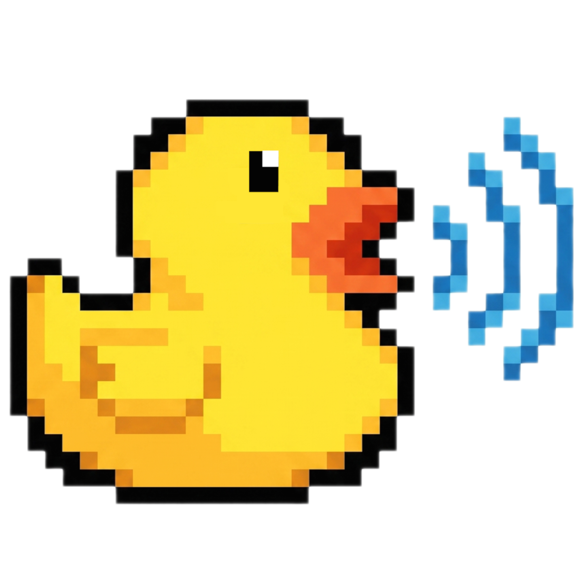

<p align="center">
  
</p>

<h1 align="center">Ducker</h1>

<p align="center">A browser extension that automatically lowers (ducks) the volume of background tabs so the tab you're actually focused on stays clearly audible.</p>

<p align="center">
  
  
  
  
</p>

## Features

**Home**

- Automatic ducking of all audible tabs when a primary tab is active
- Adjustable overall ducking level (or per-tab volume when Auto Duck is off)
- Live summary of active/playing/ducked tabs
- Mute/unmute and pin individual tabs
- Deep audio control for sites where normal volume control doesn't work (e.g. Spotify, Scrimba) via `chrome.tabCapture` + Web Audio

**Settings**

- Light / Dark / System theme, plus accent themes
- Hide the ratings section
- Opposite semantics option (Duck Strength vs. Background Volume)
- Adjustable volume fade duration

## How it works

Ducker ducks audio in two ways depending on the site:

1. **DOM-based ducking** — for most sites, it finds `<audio>`/`<video>` elements on the page and adjusts `element.volume` directly.
2. **Tab capture ducking** — for sites that control audio through the Web Audio API or DRM (where `.volume` has no effect, like Spotify), it captures the tab's audio stream via `chrome.tabCapture`, routes it through an offscreen `AudioContext`/`GainNode`, and adjusts volume there instead. This requires a one-time user gesture (e.g. touching a volume slider) per tab, per Chrome's security model.

`chrome.tabs.audible` is used as a DOM-independent signal so tabs playing audio with no visible media element (e.g. Spotify tracks with only a static image) still show up and can be controlled.

## Tech stack

- [WXT](https://wxt.dev) — extension framework
- Vanilla JavaScript
- CSS Modules
- Chrome Extension APIs: `tabs`, `scripting`, `tabCapture`, `offscreen`
- Web Audio API: `AudioContext`, `GainNode`

## Project structure

```
src/
├── components/       # Popup UI components (home, settings, header, footer)
├── core/              # Shared logic: ducking, messaging, storage, SPA router
├── entrypoints/       # WXT entrypoints: background, content, popup, offscreen
├── helpers/           # Icon helpers (Lucide)
├── layouts/           # Popup layout shell
├── pages/             # Popup pages (home, settings)
├── public/            # Static assets (icons)
├── styles/            # Shared/global CSS
└── utils/             # Small utilities (debounce, truncate, theming, etc.)
```

## Getting started

```bash
# install dependencies
npm install

# start dev mode (Chrome)
npm run dev

# start dev mode (Firefox)
npm run dev:firefox

# build for production
npm run build

# package as a .zip for store submission
npm run zip
```

Load the extension in Chrome via `chrome://extensions` → **Load unpacked** → select the generated `.output/chrome-mv3` folder (created after `npm run dev` or `npm run build`).

## Permissions

| Permission                     | Why                                                     |
| ------------------------------ | ------------------------------------------------------- |
| `storage`                      | Persist settings (theme, fade duration, etc.)           |
| `tabs`                         | Read tab info and audible state                         |
| `scripting`                    | Inject content scripts                                  |
| `tabCapture`                   | Capture tab audio for sites `.volume` can't control     |
| `offscreen`                    | Host the `AudioContext`/`GainNode` used for tab capture |
| `<all_urls>` (host permission) | Duck audio on any site                                  |

## Known limitations

- **Deep audio control requires a manual trigger, per tab.** Chrome only allows `chrome.tabCapture` to start after a real user gesture (e.g. touching a volume slider) — Ducker can't silently start capturing a tab's real output the instant it begins playing. Mute, pin, and visibility work immediately on any tab; deep volume/ducking control on Web-Audio/DRM sites (Spotify, Scrimba, etc.) only kicks in after that first touch.

## Privacy Policy

Ducker does not collect, store, transmit, or sell any personal data, browsing history, or user activity to any external server, third party, or analytics service. Ducker has no backend server, it runs entirely on your device.

For more information, please see the [Privacy Policy](https://izynegallardo.github.io/smart-duck/).

## License

This project is licensed under the [MIT License](LICENSE).
